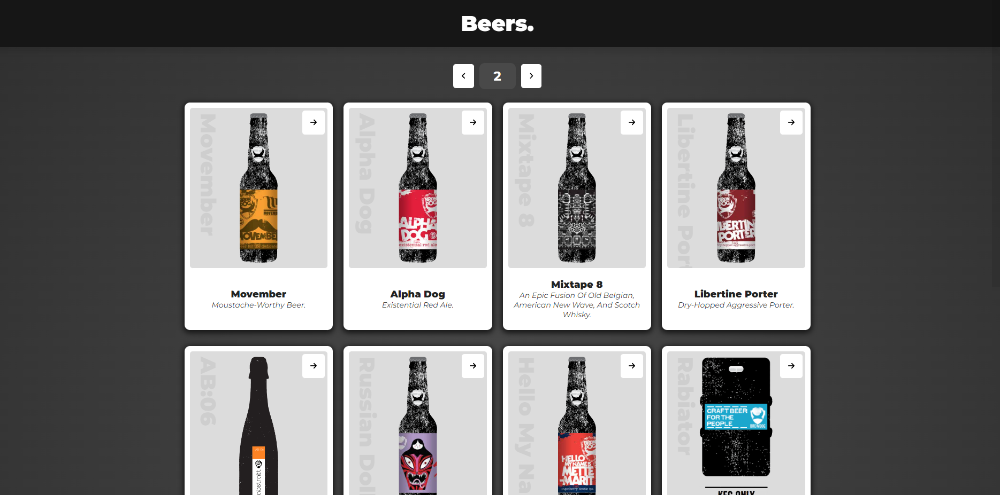

# ExLabs - zadanie rekrutacyjne

## Wymagania
- Kiedy ładuje się treść, użytkownik powinien być tego świadomy (wyświetl spinner lub skeleton loader) - ✓
- Aplikacja powinna być responsywna i działać na urządzeniach mobilnych - ✓
- Podstrona z konkretnym piwem powinna być dostępna również poprzez URL np. `/details/:beerId` - ✓
- Na stronie głównej piwa powinny zawierać minimum informacje takie jak zdjęcie, nazwa piwa oraz tagline (są to dane z API) - ✓
- Dedykowana podstrona z piwem powinna zawierać minimum informacje takie jak zdjęcie, nazwa piwa, tagline, description, abv, ibu, ingredients (są to dane z API) - ✓
- Powinniśmy móc uruchomić aplikację poprzez komendę `npm install && npm start` - ✓

## Od siebie dorzuciłem
- Prefetchowanie danych z api.
- Zabezpieczenie routera, obsłużenie `404 - Page not found`.
- Obsługę błędów przy fetchowaniu danych (a także obsługę sytuacji, w której zostanie pobrana pusta tablica).
- Kilka testów, które w małym stopniu mogą zobrazować w jaki sposób je piszę.
- Konfigurację środowiska (linter, ładniejsze importy, itd.)

## Dostępne skrypty

### `npm install`

Instaluje wszystko co potrzebne.

### `npm start`

Standardowo uruchamia aplikację w środowisku deweloperskim.\
Po uruchomieniu dostępna jest pod adresem [http://localhost:3000](http://localhost:3000).

### `npm run build`

Buduje aplikację i zapisuje do folderu `build`.

### `npm run cypress:component`

Uruchamia napisane testy jednostkowe (jest ich kilka, chciałem pokazać swój koncept pisania testów oparty na wzorcu Page Objects).

# Galeria

Główny widok aplikacji

Informacje o danym piwie

Widok dla ludzi robiących literówki w adresie url

Widok dla tych, co próbują wyszukiwać informacji o piwie, które nie istnieje

# Wersja live

https://hcywka-beers.netlify.app \
Miłego przeglądania i do usłyszenia :)
