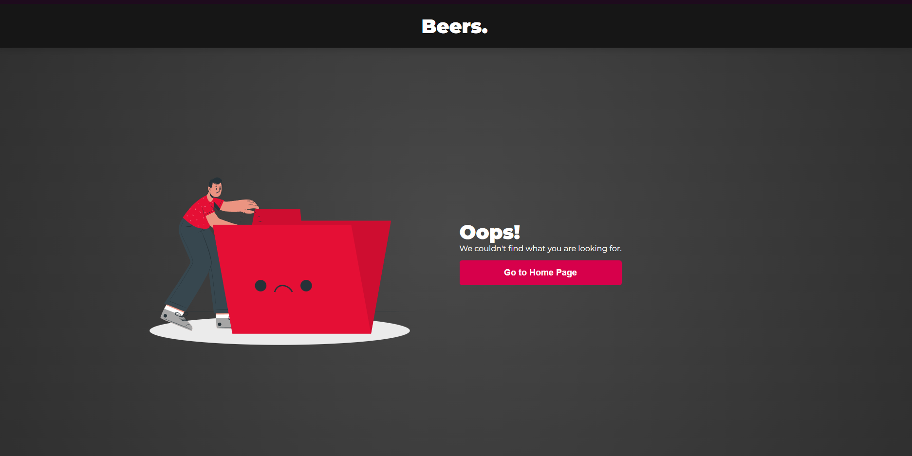

# Beers.
Example technical task for junior frontend developer job.

### Live demo
https://hcywka-beers.netlify.app \

## Requirements
- When content is loading, user should be aware of that (display spinner or skeleton loader) - ✓
- App should be responsive and work on mobiles - ✓
- Beer details should also be available on another page, i.e. via URL `/details/:beerId` - ✓
- Home page should contain at least beer name, tagline and picture of every beer - ✓
- Beer details page should contain at least picture, name, tagline, description, abv, ibu, ingredients - ✓

## Additional things I have done
- Data prefetching,
- Securing router, handling `404 - Page not found`.
- Few tests in Cypress with usage of Page Objects pattern.
- Environment configuration (linter, absolute imports, itd.)

## Available scripts

### `npm install`

Installs application.

### `npm start`

Runs app in development environment.\
It should be available at [http://localhost:3000](http://localhost:3000).

### `npm run build`

Build app in production mode and saves it in `build` directory.

### `npm run cypress:component`

Runs unit tests.

# Gallery

Main app view

Specific beer details

404 page

Example of handling api error

